# WhaleHub Jewel-Swap — Protocol Documentation

> A staking protocol on Stellar where users lock AQUA tokens and earn BLUB rewards.
> Smart contract version: **v1.2.0**

---

## Table of Contents

1. [What is WhaleHub?](#1-what-is-whalehub)
2. [How the System is Connected](#2-how-the-system-is-connected)
3. [What Gets Stored On-Chain](#3-what-gets-stored-on-chain)
4. [Step-by-Step Flows](#4-step-by-step-flows)
   - [Locking AQUA to Earn Rewards](#41-locking-aqua-to-earn-rewards)
   - [Restaking BLUB](#42-restaking-blub)
   - [Withdrawing (Unstaking)](#43-withdrawing-unstaking)
   - [How Rewards Are Shared](#44-how-rewards-are-shared)
   - [Protocol Liquidity Cycle](#45-protocol-liquidity-cycle)
   - [ICE Governance Tokens](#46-ice-governance-tokens)
5. [All Contract Functions](#5-all-contract-functions)
6. [Numbers & Formulas](#6-numbers--formulas)
7. [Frontend App Structure](#7-frontend-app-structure)
8. [Live Contract Addresses](#8-live-contract-addresses)
9. [How to Deploy & Build](#9-how-to-deploy--build)
10. [Bugs Fixed & Edge Cases](#10-bugs-fixed--edge-cases)

---

## 1. What is WhaleHub?

WhaleHub lets users **lock AQUA tokens** for a set period of time and earn **BLUB tokens** as a reward. Think of it like a fixed-term deposit — the longer you lock, the more you earn.

### Quick Reference

| What | How it works |
|---|---|
| **Token you deposit** | AQUA (Aquarius governance token) |
| **Token you receive** | BLUB — minted by the protocol as a receipt + reward |
| **How much BLUB you get** | 1 AQUA locked → 1.0 BLUB in your staking account + 0.1 BLUB goes to the liquidity pool |
| **Lock duration** | You choose — measured in time periods set by the protocol |
| **Waiting period to withdraw** | 10 days after your lock expires |
| **Waiting period between reward claims** | 7 days |
| **Protocol fee on pool earnings** | 30% goes to the treasury, 70% goes back to stakers |

---

## 2. How the System is Connected

This diagram shows all the moving parts and how they talk to each other.

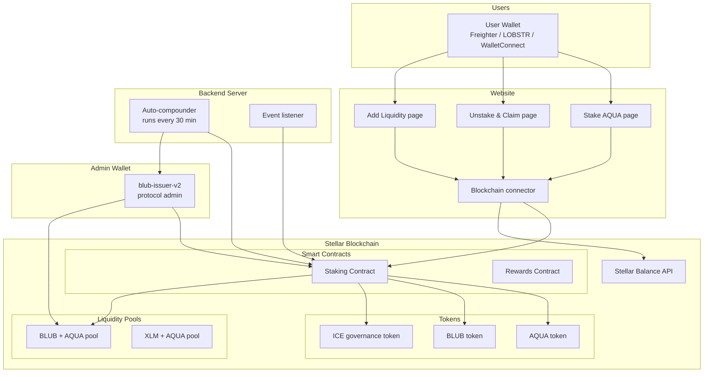

---

## 3. What Gets Stored On-Chain

### 3.1 Protocol Settings (Config)

Everything the protocol needs to know to operate:

```
Settings {
  Admin wallet address
  Contract version (1.2.0)
  Total BLUB ever minted
  Treasury wallet address
  AQUA token address
  BLUB token address
  Liquidity pool address
  ICE token addresses (4 types)
  Staking period length (in minutes)
  Fee wallet address         ← receives 30% of pool earnings
  Fee percentage             ← 30%
  Withdrawal waiting period  ← 10 days
  Reward claim waiting period ← 7 days
}
```

### 3.2 Each User's Lock Position

One record is created per lock:

```
Lock Position {
  Owner address
  AQUA amount locked
  BLUB amount in staking pool
  When it was locked (timestamp)
  How long the lock lasts (minutes)
  When it unlocks (timestamp)
  Reward multiplier (duration bonus)
  Transaction ID
  AQUA contributed to liquidity pool (10%)
  Type: AQUA lock OR BLUB restake
  Status: locked / unlocked
}
```

### 3.3 Reward Tracking (Global)

Tracks how much reward each staked BLUB has earned globally:

```
Global Rewards {
  Reward per BLUB token (running total)  ← increases each time admin adds rewards
  Total BLUB currently staked
  Total rewards ever added
  Total rewards ever claimed
  Last update time
}
```

### 3.4 Reward Tracking (Per User)

Each user's personal snapshot:

```
User Rewards {
  My BLUB staked in reward pool
  Reward-per-BLUB at my last checkpoint  ← used to calculate what I've earned
  Rewards waiting for me to claim
  When I last claimed
}
```

### 3.5 Global Protocol State

```
Protocol State {
  Total AQUA locked by all users
  Total BLUB ever minted
  Reentrancy lock (prevents double-spending attacks)
  AQUA queued for ICE locking
}
```

### 3.6 How data is organised on-chain

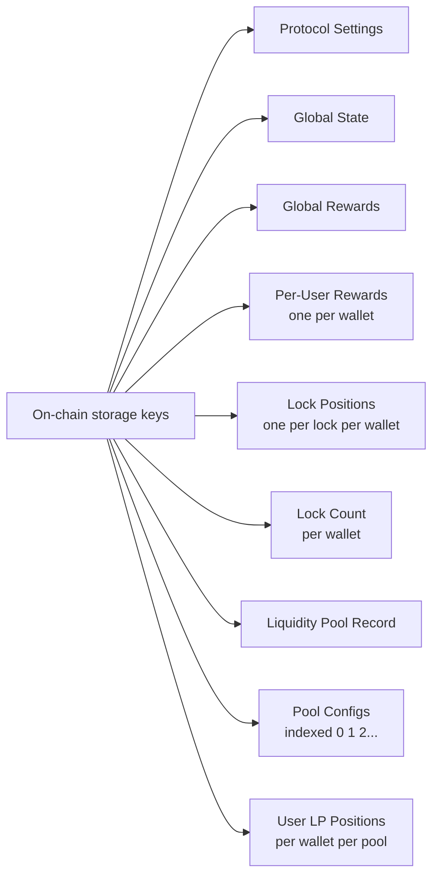

---

## 4. Step-by-Step Flows

### 4.1 Locking AQUA to Earn Rewards

**What happens when a user locks AQUA:**

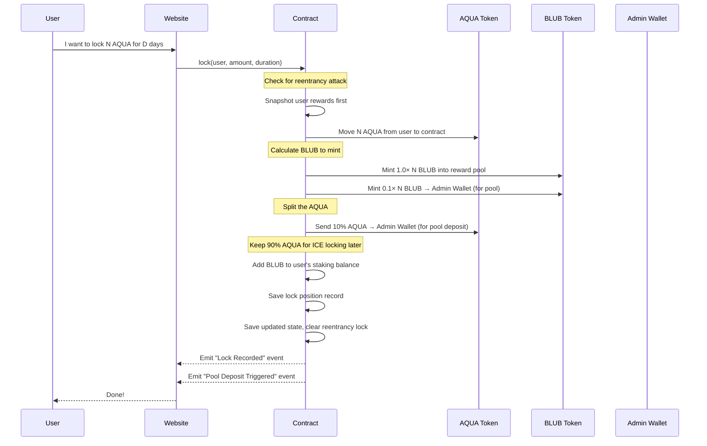

**Token split summary:**

```
User locks 100 AQUA
│
├── 90 AQUA  → stays in contract (queued for ICE locking)
└── 10 AQUA  → admin wallet (will be deposited into BLUB-AQUA pool)

Contract mints 110 BLUB
├── 100 BLUB → user's staking balance (earns rewards)
└──  10 BLUB → admin wallet (will be deposited into BLUB-AQUA pool)
```

---

### 4.2 Restaking BLUB

Users can also lock BLUB tokens they already hold (instead of AQUA):

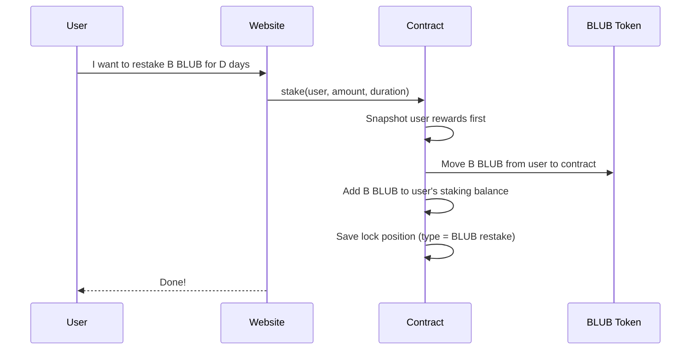

---

### 4.3 Withdrawing (Unstaking)

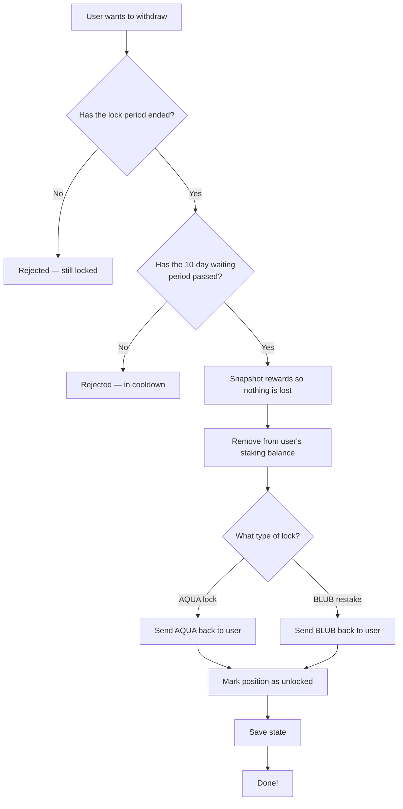

> **Important:** Rewards are NOT automatically sent when you withdraw. You must claim them separately using `claim_rewards`.

---

### 4.4 How Rewards Are Shared

WhaleHub uses the **Synthetix reward model** — a battle-tested approach where rewards are split fairly based on each user's share of the pool at any given moment.

**Step 1 — Admin adds rewards:**

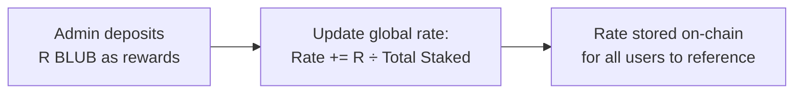

**Step 2 — User's rewards are calculated at checkpoint:**

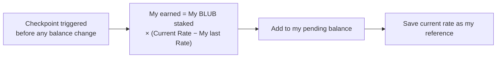

**Step 3 — User claims:**

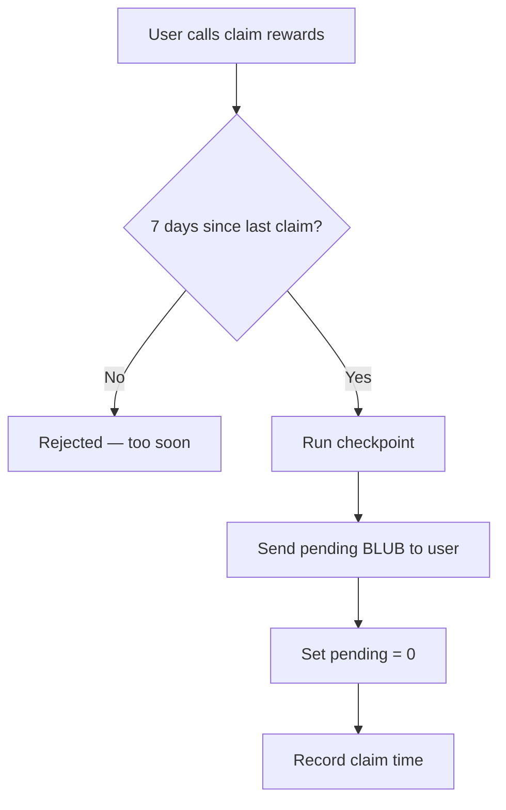

---

### 4.5 Protocol Liquidity Cycle

Every 30 minutes, the backend server collects and redistributes earnings from the BLUB-AQUA liquidity pool.

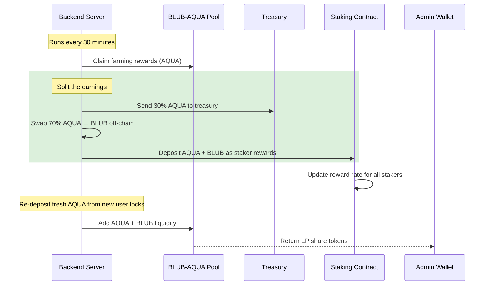

> **Current status:** Backend currently re-deposits 100% back as liquidity. The 30%/70% split is designed but not yet live.

---

### 4.6 ICE Governance Tokens

ICE is Aquarius's governance token. It is **soulbound** — it cannot be transferred, it permanently stays on the wallet that locked the AQUA on classic Stellar.

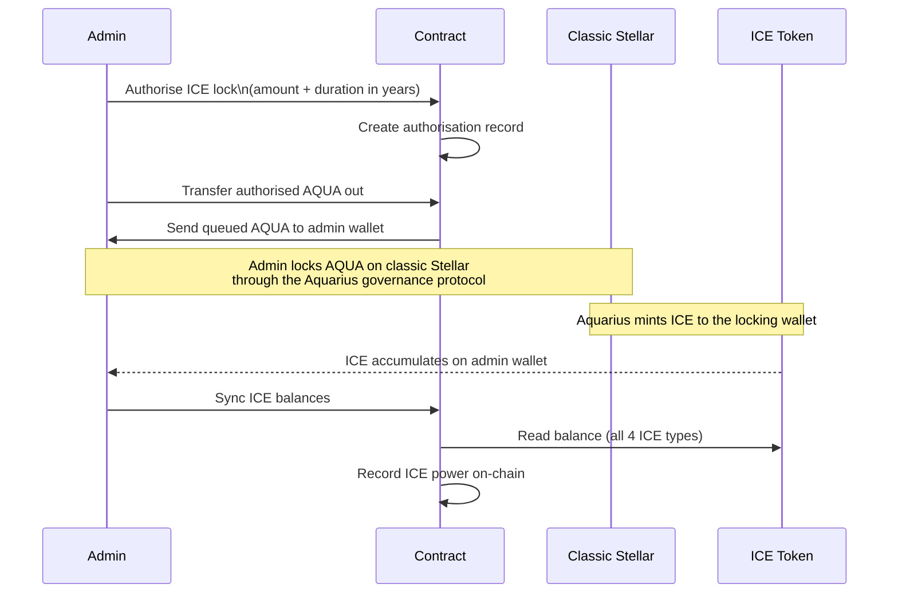

**Why ICE matters:**

```
Admin wallet holds ICE
        ↓
Admin wallet deposits LP into Aquarius pool
        ↓
Aquarius sees ICE on depositing wallet
        ↓
2.5× multiplier applied to pool rewards
        ↓
More AQUA earned per period → more for stakers
```

> Because ICE cannot be moved to the staking contract, the LP must be deposited **from the admin wallet** to benefit from the 2.5× boost.

---

## 5. All Contract Functions

### User-facing

| Function | Who calls it | What it does |
|---|---|---|
| `lock(user, amount, duration)` | User | Lock AQUA, receive BLUB |
| `stake(user, amount, duration)` | User | Restake BLUB tokens |
| `record_unlock(user, lock_index)` | User | Withdraw after cooldown |
| `claim_rewards(user)` | User | Claim earned BLUB (7-day cooldown) |

### Admin-only

| Function | What it does |
|---|---|
| `initialize(...)` | First-time setup of the contract |
| `add_rewards(admin, amount)` | Deposit BLUB rewards, update the reward rate |
| `add_rewards_from_aqua(admin, aqua, blub)` | Deposit both AQUA and BLUB, distribute BLUB to stakers |
| `record_pol_rewards(admin, amount, ice_power)` | Log pool earnings and split to stakers / treasury |
| `authorize_ice_lock(amount, years)` | Allow AQUA to be moved out for classic ICE locking |
| `transfer_authorized_aqua(lock_id)` | Send authorised AQUA to admin wallet |
| `sync_all_ice_balances()` | Read ICE balances after governance receives them |
| `update_sac_admin(admin, new_admin)` | Change BLUB token admin (needed for minting) |
| `update_vault_treasury(admin, addr)` | Change fee recipient |
| `update_vault_fee_bps(admin, bps)` | Change fee percentage |
| `upgrade(new_wasm_hash)` | Upgrade contract code |
| `migrate_v1_2_0(admin)` | One-time migration to v1.2 reward system |

### View only (read, no fee)

| Function | What it returns |
|---|---|
| `get_config()` | All protocol settings |
| `get_global_state()` | Total locked, total minted, etc. |
| `get_reward_state()` | Global reward accumulator |
| `get_user_reward_state(user)` | User's reward snapshot |
| `get_user_lock_count(user)` | How many lock positions this user has |
| `get_user_lock_by_index(user, i)` | Details of a specific lock |
| `get_user_total_staked_blub(user)` | Total BLUB in the reward pool for this user |
| `calculate_user_rewards(user)` | How much BLUB is waiting to be claimed |
| `get_protocol_owned_liquidity()` | Full POL accounting |
| `get_daily_pol_snapshot(day)` | Historical pool snapshot |
| `get_available_pol_balance()` | Available AQUA and BLUB in the pool |
| `test_staking_calculations(amount, duration)` | Simulate a lock without sending tokens |

---

## 6. Numbers & Formulas

### Reward accumulator formula

When admin adds `R` BLUB rewards and `T` BLUB is currently staked:

```
Global rate increases by:  R × 1_000_000_000_000 ÷ T

Your earned rewards:       Your BLUB staked
                         × (Current global rate − Your last saved rate)
                         ÷ 1_000_000_000_000
```

The large precision number (10¹²) is used to avoid rounding errors in integer math.

### What you get when you lock

```
You lock: 100 AQUA

BLUB minted for you:     100 BLUB  → goes into reward pool
BLUB for liquidity:       10 BLUB  → goes to admin (for pool deposit)
AQUA for liquidity:       10 AQUA  → goes to admin (for pool deposit)
AQUA kept in contract:    90 AQUA  → queued for ICE locking
```

### APY estimate

```
APY = (reward_rate ÷ 10,000) × (525,600 ÷ lock_duration_in_minutes) × 100%
```

Minimum lock is 7 days. Duration is rounded to the nearest 5-minute interval.

---

## 7. Frontend App Structure

```
src/
├── components/
│   ├── NewStakeLayout/
│   │   ├── STKAqua.tsx        ← AQUA lock UI
│   │   ├── Yield.tsx          ← Unstake and claim rewards
│   │   ├── AddLiquidity.tsx   ← Admin: add liquidity to pool
│   │   └── PolInfo.tsx        ← Show pool stats
│   └── Navbar/                ← Wallet connect buttons
│
├── lib/
│   ├── store.ts               ← Redux store (persisted to localStorage)
│   └── slices/
│       ├── stakingSlice.ts    ← Staking balances, APY, lock data
│       ├── userSlice.ts       ← Wallet address, token balances
│       └── appSlice.ts        ← UI flags and modals
│
├── services/
│   ├── soroban.service.ts         ← Sends transactions to the blockchain
│   ├── soroban-staking.service.ts ← Staking-specific calls
│   └── stellar.service.ts         ← Reads balances from Stellar Horizon
│
├── config/
│   ├── soroban.config.ts    ← Contract addresses, network, feature flags
│   └── index.ts             ← App-level constants
│
└── pages/
    └── Stake/index.tsx      ← Main page
```

### How a user action becomes a blockchain transaction

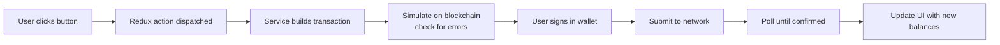

### Supported wallets

| Wallet | Platform |
|---|---|
| Freighter | Browser extension |
| LOBSTR | Mobile + browser |
| WalletConnect | Any compatible wallet |

---

## 8. Live Contract Addresses

### Smart Contracts

| Contract | Address |
|---|---|
| **Staking Contract** | `CC72BEVVKHQ57PB5FCKAZYRXCSR6DOQSTN46QR7RZMMM64YWNRPDS24S` |
| **Rewards Contract** | `CC67FMPFQNGSFTXK53VUJ5FUTYQC6XVJPFZJCVTP4EGH7ZCQBNFOXQ5P` |

### Tokens

| Token | Address |
|---|---|
| **BLUB** | `CBMFDIRY5OKI4JJURXC4SMEQPWB4UUADIADJK4NA6CYBNOYK4W4TMLLF` |
| **AQUA** | `CAUIKL3IYGMERDRUN6YSCLWVAKIFG5Q4YJHUKM4S4NJZQIA3BAS6OJPK` |
| **ICE** | `CARCKZ66U4AI2545NS4RAF47QVEXG3PRRCDA52H4Q3FDRAGSMP4BRU3W` |
| **Native XLM** | `CAS3J7GYLGXMF6TDJBBYYSE3HQ6BBSMLNUQ34T6TZMYMW2EVH34XOWMA` |

### Liquidity Pools

| Pool | Address |
|---|---|
| **BLUB + AQUA pool** | share token: `CDMRHKJCYYHZTRQVR7NY43PR7ISMRBYC2O57IMVAQ7B7P2I2XGIZLI5E` |
| **XLM + AQUA pool** | `CCY2PXGMKNQHO7WNYXEWX76L2C5BH3JUW3RCATGUYKY7QQTRILBZIFWV` |

### Admin

| Role | Address |
|---|---|
| **Protocol Admin** (`blub-issuer-v2`) | `GDERSSCKJQPPXUQOZIOXGRVAGNLVPVZCJ2MAX7RCMVMWGRPVAEG7XGTK` |

---

## 9. How to Deploy & Build

### Build the smart contract

```bash
# Build WASM binary
cargo build --release --target wasm32-unknown-unknown --package whalehub-staking

# Optimise (required — shrinks from ~133KB to ~119KB)
stellar contract optimize \
  --wasm target/wasm32-unknown-unknown/release/whalehub_staking.wasm

# Upload to blockchain (costs ~140 XLM)
stellar contract install \
  --source blub-issuer-v2 \
  --network mainnet \
  --wasm target/wasm32-unknown-unknown/release/whalehub_staking.optimized.wasm
```

### Upgrade the contract

```bash
stellar contract invoke --id CC72BEVVKHQ... --source blub-issuer-v2 --network mainnet -- upgrade --new_wasm_hash <HASH>
```

### Minting BLUB (3-step process)

BLUB's mint authority belongs to the staking contract, not the admin wallet directly. To mint:

```bash
# 1. Hand mint authority to admin wallet
stellar contract invoke --id CC72... -- update_sac_admin --admin GDERSSCK... --new_admin GDERSSCK...

# 2. Mint tokens
stellar contract invoke --id CBMFDIRY... -- mint --to <recipient> --amount <amount>

# 3. Return mint authority to staking contract
stellar contract invoke --id CC72... -- update_sac_admin --admin GDERSSCK... --new_admin CC72...
```

> Always write commands as a single line — line breaks with `\` can silently add trailing spaces that break CLI parsing.

### Run the frontend

```bash
npm install   # install dependencies
npm start     # development server at localhost:3000
npm run build # production build
```

### Required environment variables

```env
REACT_APP_STELLAR_NETWORK=mainnet
REACT_APP_SOROBAN_RPC_URL=https://soroban-rpc.mainnet.stellar.network
REACT_APP_HORIZON_URL=https://horizon.stellar.org
REACT_APP_STAKING_CONTRACT=CC72BEVVKHQ57PB5FCKAZYRXCSR6DOQSTN46QR7RZMMM64YWNRPDS24S
REACT_APP_BLUB_CONTRACT=CBMFDIRY5OKI4JJURXC4SMEQPWB4UUADIADJK4NA6CYBNOYK4W4TMLLF
REACT_APP_AQUA_CONTRACT=CAUIKL3IYGMERDRUN6YSCLWVAKIFG5Q4YJHUKM4S4NJZQIA3BAS6OJPK
```

---

## 10. Bugs Fixed & Edge Cases

### Contract bugs (fixed 2026-02-08)

| Bug | What went wrong | How it was fixed |
|---|---|---|
| **Reward rate never increased** | During migration, the reward checkpoint read the balance *after* the new tokens were added, so old balance = new balance, delta = 0, rate never moved | Read balance *before* the update |
| **State got overwritten** | Functions saved a local copy of the global state, called a helper that also saved global state, then the original saved its stale copy on top | Use one local variable throughout, save it only once at the very end |
| **Unstaking used dead code** | Unstake looked up a `UserLockTotals` table that nothing ever wrote to | Removed the dead lookup, switched fully to the Synthetix reward model |
| **Per-user totals always zero** | `lock()` wrote to a global totals table; `unstake()` and views read from a per-user totals table | Unified everything into the Synthetix reward model |

### Frontend bugs (fixed 2026-02-19)

| Bug | What went wrong | How it was fixed |
|---|---|---|
| **Balance didn't update after unstaking** | The balance refresh code created a new wallet connection using only the Freighter extension — this silently fails for LOBSTR and WalletConnect users | Use the already-known wallet address from app state instead |
| **Balance showed old value briefly** | Stellar's RPC node returns stale data for 3–8 seconds after a transaction confirms | Added a second balance fetch 7 seconds after success |

### XLM balance edge case

- Reading an XLM balance returns the **total** amount, including the reserve the account must keep
- Sending XLM enforces the reserve — so a send can fail even when the balance looks sufficient
- Fix: use the Horizon API to compute the **spendable** balance (total minus required reserve)

### Security pattern: preventing double-spend (reentrancy guard)

```
START of any write function:
  1. Read global state
  2. Set "locked = true" flag
  3. Do all calculations
  4. Update all numbers
  5. Set "locked = false"
  6. Save global state ← only once, at the very end

If contract calls itself mid-execution → sees locked=true → rejects immediately
```

### Pending work

- [ ] **Earnings split** — backend needs to send 30% to treasury and 70% to stakers (currently sends 100% back as liquidity)
- [ ] **Admin/Operator separation** — separate a cold multisig (admin, for upgrades) from the hot wallet (operator, for daily ops)
- [ ] **ICE 2.5× boost** — restructure pool deposits to come from the admin wallet so its ICE power multiplies the rewards

---

## Tech Stack

| Layer | Technology |
|---|---|
| Smart contract language | Rust |
| Smart contract SDK | soroban-sdk 21.7.0 |
| Compiled target | WebAssembly (WASM) |
| Blockchain | Stellar mainnet (Soroban) |
| Frontend framework | React 18.2 |
| Frontend language | TypeScript 4.9 |
| State management | Redux Toolkit 2.2 + redux-persist |
| Styling | Tailwind CSS |
| Stellar SDK | @stellar/stellar-sdk 12.2 |
| Wallet integration | @creit.tech/stellar-wallets-kit 1.6 |
| Build tool | react-app-rewired |
| Backend | Node.js — lives in `whalehub_server` repo |
