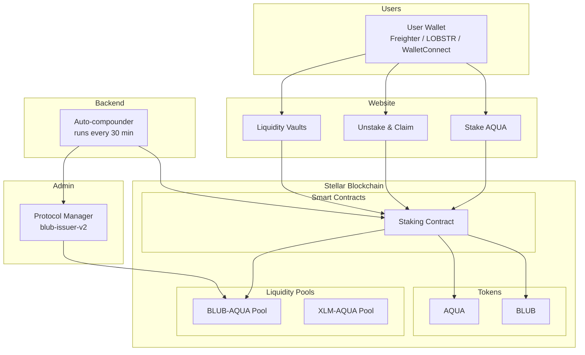

# How It Works

Whalehub connects users, smart contracts, liquidity pools, and a backend automation server into a single yield-generating system.

## System Overview

## The Yield Cycle

1. **User locks AQUA** — 90% stays in the contract (queued for ICE governance locking), 10% goes to the admin wallet for liquidity pool deposits
2. **BLUB is minted** — 1.0 BLUB per AQUA locked goes to the user's staking balance, 0.1 BLUB goes to the admin for pool liquidity
3. **Liquidity earns rewards** — AQUA and BLUB deposited into Aquarius AMM pools earn trading fees and AQUA farming rewards
4. **Rewards are distributed** — Every 30 minutes, the backend claims pool rewards, swaps to BLUB, and distributes to stakers
5. **User claims BLUB** — Stakers can claim their accumulated BLUB rewards (7-day cooldown between claims)

## Two Ways to Earn

### Staking
Lock AQUA for a chosen duration. Earn BLUB rewards from pool earnings distributed proportionally to all stakers. Longer locks = higher reward multiplier.

### Liquidity Vaults
Deposit token pairs into auto-compounding AMM pools. The backend automatically claims rewards and re-deposits them 48 times per day, growing your LP position through compound interest.
