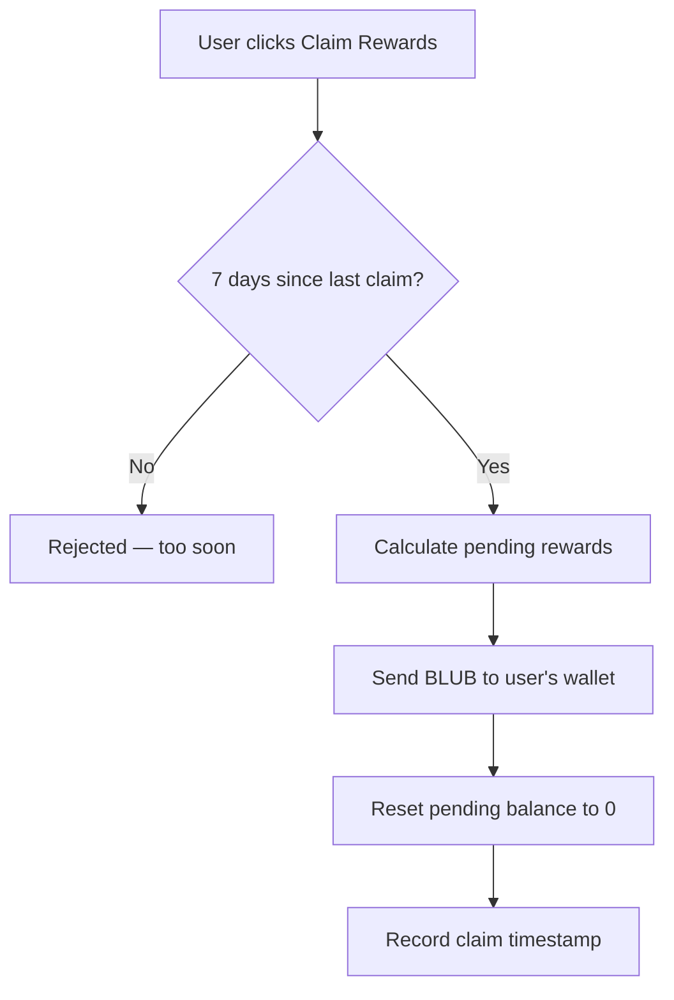

# Claiming Rewards

BLUB rewards accumulate continuously while your tokens are staked. You can claim them every 7 days.

## How Claiming Works



## Important Notes

- **Rewards are NOT automatic** — you must claim them manually
- **7-day cooldown** between claims
- **Rewards are separate from unstaking** — withdrawing your locked tokens does NOT automatically send your rewards
- Rewards continue accumulating even if you don't claim them — nothing is lost by waiting

## How Rewards Are Calculated

Whalehub uses the **Synthetix reward model** — rewards are split fairly based on each user's share of the total staked pool.

```
Your pending rewards = Your staked BLUB × (Current reward rate − Your last checkpoint rate)
```

The reward rate increases every time the protocol distributes new BLUB from pool earnings. Your share is proportional to how much BLUB you have staked relative to the total.

## Where Do Rewards Come From?

Every 30 minutes, the backend:

1. Claims AQUA farming rewards from the BLUB-AQUA liquidity pool
2. Sends 30% to the protocol treasury
3. Swaps 70% to BLUB
4. Distributes that BLUB to all stakers proportionally
