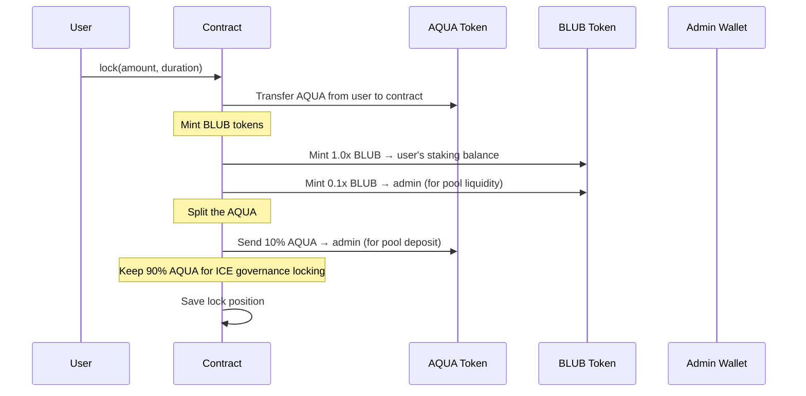

# Locking AQUA

Staking on Whalehub means locking your AQUA tokens for a chosen duration. In return, you receive BLUB tokens that earn rewards proportional to the protocol's liquidity pool earnings.

## What Happens When You Lock



## Token Split Example

```
You lock 100 AQUA
│
├── 90 AQUA  → stays in contract (queued for ICE governance locking)
└── 10 AQUA  → admin wallet (deposited into BLUB-AQUA liquidity pool)

Contract mints 110 BLUB
├── 100 BLUB → your staking balance (earns rewards)
└──  10 BLUB → admin wallet (deposited into BLUB-AQUA liquidity pool)
```

## Lock Duration

- **Minimum lock**: 7 days
- You choose your lock duration when staking
- Longer locks earn a higher reward multiplier
- Once locked, you cannot withdraw until the lock period expires **plus** a 10-day cooldown

## How Rewards Accumulate

Your locked BLUB earns a share of all rewards distributed by the protocol. Rewards are calculated using a proportional model — if you hold 1% of all staked BLUB, you earn 1% of all distributed rewards.

Rewards accumulate continuously but can only be claimed every 7 days. See [Claiming Rewards](claiming-rewards.md) for details.
