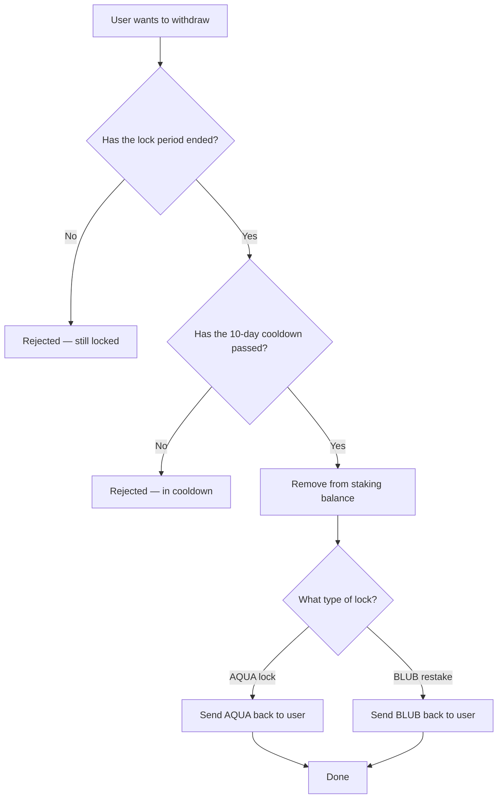

# Unstaking

After your lock period expires and the cooldown passes, you can withdraw your original tokens.

## Withdrawal Process



## Timeline

```
Day 0          Day 30              Day 40
│── Lock ──────│── 10-day cooldown ─│── Can withdraw ──→
  (locked)       (expired, waiting)    (ready)
```

## Key Points

- **Lock period**: the duration you chose when staking (minimum 7 days)
- **Cooldown**: 10 additional days after the lock expires
- **Partial unstaking**: you can unstake specific lock positions without affecting others
- **Rewards are separate**: unstaking does NOT claim your pending BLUB rewards — use [Claim Rewards](claiming-rewards.md) for that
- **You receive back** the same token type you deposited (AQUA for AQUA locks, BLUB for BLUB restakes)
