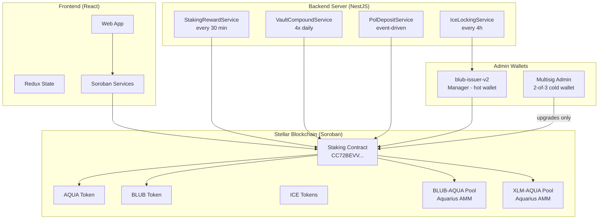

# Architecture

Whalehub is composed of three main layers: smart contracts on Stellar (Soroban), a backend automation server, and a React frontend.

## System Diagram

## Admin / Manager Split

The contract separates two roles for security:

| Role | Wallet | Purpose | Security |
|------|--------|---------|----------|
| **Admin** | Multisig (2-of-3) | Contract upgrades, config changes | Cold wallet, requires co-signer |
| **Manager** | blub-issuer-v2 | Daily operations: rewards, compounding, ICE | Hot wallet, used by backend |

## Backend Services

| Service | Schedule | Function |
|---------|----------|----------|
| **StakingRewardService** | Every 30 min | Claims pool rewards, swaps to BLUB, distributes to stakers |
| **VaultCompoundService** | 4x daily | Claims and auto-compounds vault LP for pools 1+ |
| **IceLockingService** | Every 4 hours | Locks AQUA into ICE governance on classic Stellar |
| **PolDepositService** | Event-driven | Deposits new AQUA+BLUB into liquidity pools |

## Tech Stack

| Layer | Technology |
|-------|------------|
| Smart contract | Rust + soroban-sdk 21.7.0 → WASM |
| Blockchain | Stellar mainnet (Soroban) |
| Frontend | React 18 + TypeScript + Redux Toolkit |
| Styling | Tailwind CSS |
| Backend | NestJS (TypeScript) |
| Hosting | Digital Ocean App Platform |
| Wallet SDK | @creit.tech/stellar-wallets-kit |
| Stellar SDK | @stellar/stellar-sdk 12.2 |
