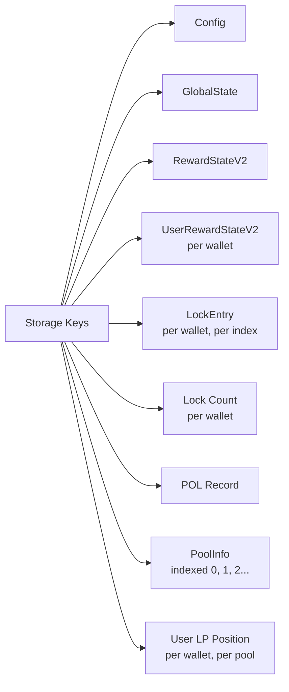

# On-Chain Data

All protocol state is stored on the Stellar blockchain via Soroban contract storage.

## Protocol Settings (Config)

```
Config {
  admin                    // Multisig admin address (upgrades, config)
  manager                  // Manager address (daily operations)
  version                  // Contract version
  total_blub_minted        // Cumulative BLUB ever minted
  treasury                 // Fee recipient address
  aqua_token               // AQUA token contract address
  blub_token               // BLUB token contract address
  liquidity_contract       // Primary liquidity pool address
  ice_tokens[4]            // ICE, governICE, upvoteICE, downvoteICE
  staking_period           // Lock period unit (minutes)
  fee_address              // Treasury wallet
  fee_percentage           // Treasury fee (30%)
  withdrawal_period        // Cooldown after lock expires (10 days)
  reward_claim_period       // Minimum time between claims (7 days)
}
```

## Lock Position (Per User, Per Lock)

```
LockEntry {
  owner                    // User's wallet address
  amount                   // AQUA (or BLUB) amount locked
  blub_locked              // BLUB in staking pool for this lock
  locked_at                // Timestamp when locked
  duration                 // Lock duration (minutes)
  unlock_at                // When lock expires
  reward_multiplier        // Duration-based bonus
  tx_id                    // Transaction hash
  aqua_for_pool            // AQUA sent to liquidity (10%)
  entry_type               // AQUA lock or BLUB restake
  unlocked                 // Whether position has been withdrawn
}
```

## Global Reward State

```
RewardStateV2 {
  reward_per_token         // Running accumulator (scaled by 10^12)
  total_staked             // Total BLUB in reward pool
  total_rewards_added      // Cumulative BLUB distributed
  total_rewards_claimed    // Cumulative BLUB claimed by users
  last_update_time         // Last distribution timestamp
}
```

## Per-User Reward State

```
UserRewardStateV2 {
  staked_balance           // User's BLUB in reward pool
  reward_per_token_paid    // User's last checkpoint of global rate
  pending_rewards          // Unclaimed BLUB rewards
  last_claim_time          // When user last claimed
}
```

## Global Protocol State

```
GlobalState {
  total_aqua_locked        // Total AQUA locked by all users
  total_blub_minted        // Total BLUB ever minted
  reentrancy_lock          // Prevents double-spend attacks
  pending_aqua_for_ice     // AQUA queued for ICE governance locking
}
```

## Vault Pool Info

```
PoolInfo {
  pool_id                  // Numeric pool identifier
  pool_address             // Aquarius AMM pool contract
  token_a, token_b         // Pool token addresses
  share_token              // LP share token address
  total_lp_tokens          // Vault user LP tracked by contract
  active                   // Whether pool accepts deposits
}
```

## Storage Layout


