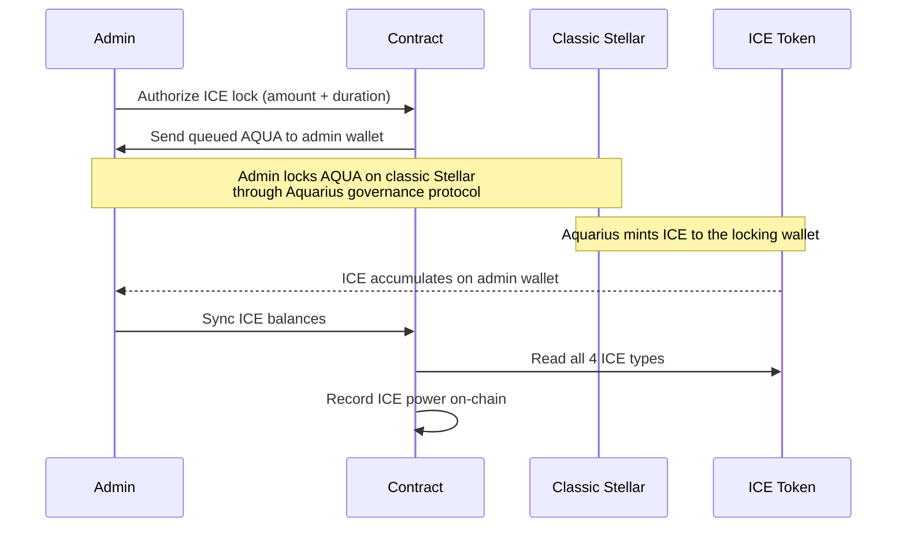

# ICE Boost

ICE is Aquarius's governance token. By locking AQUA on the Aquarius protocol, wallets receive non-transferable ICE tokens that boost liquidity pool rewards up to **2.5x**.

## How ICE Boosting Works

Aquarius uses a [Curve-style boost formula](https://docs.aqua.network/technical-documents/ice-boost-formula):

```
boost = min(0.4 × deposit + 0.6 × pool_liquidity × (my_ICE / total_ICE), deposit) / (0.4 × deposit)
```

| Variable | Meaning |
|----------|---------|
| `deposit` | Your LP tokens in the pool |
| `pool_liquidity` | Total LP tokens in the pool (all depositors) |
| `my_ICE` | Your wallet's ICE balance |
| `total_ICE` | Total ICE across all holders |

- **No ICE** → boost = **1.0x** (baseline)
- **Maximum** → boost = **2.5x** (when your ICE share >= your LP share)
- Recalculated by Aquarius **every hour**

## ICE and Whalehub

ICE is **soulbound** (non-transferable). It stays on the wallet that locked AQUA through the Aquarius governance protocol. This means:

- The protocol admin wallet (`blub-issuer-v2`) holds ICE from governance participation
- ICE boost only applies to LP deposited **by the wallet that holds ICE**
- The staking contract cannot hold ICE directly

## Current Status

The Whalehub admin wallet holds ICE from governance participation. The boost is most effective on pools where Whalehub's LP position is a small fraction of the total pool.

For large positions (like the BLUB-AQUA pool where Whalehub holds ~66% of all LP), the ICE boost has minimal effect because the ICE share (0.03% of total ICE) is far smaller than the LP share.

> **Important: Due to Stellar protocol limitations, ICE governance locking uses classic Stellar claimable balances — a mechanism that Soroban smart contracts cannot invoke directly. This means the staking contract cannot lock AQUA for ICE on its own, and vault LP deposited by the contract currently receives no ICE boost (1.0x). We are actively developing a secure architecture to route vault deposits through an ICE-holding wallet, enabling up to 2.5x boosted rewards for vault users. This feature is planned for a future release.**

## ICE Governance Flow



## Four ICE Token Types

When AQUA is locked through Aquarius, four non-transferable tokens are minted:

| Token | Purpose |
|-------|---------|
| **ICE** | Base governance power + LP boost |
| **governICE** | Voting in Aquarius governance proposals |
| **upvoteICE** | Upvoting market pairs for reward allocation |
| **downvoteICE** | Downvoting market pairs |
