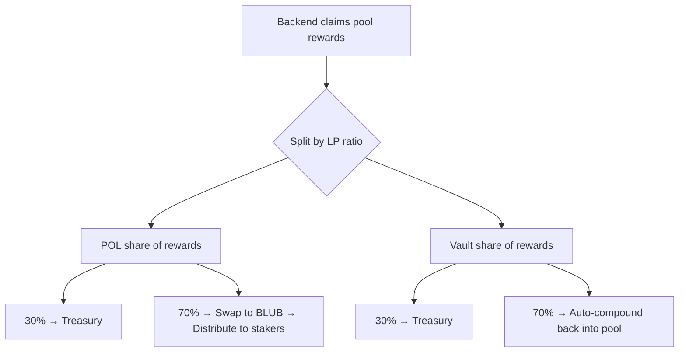

# Protocol Owned Liquidity

Protocol Owned Liquidity (POL) is liquidity that belongs to the Whalehub protocol itself, not to individual users. It generates fees and rewards that are distributed to stakers.

## How POL Is Created

When users lock AQUA, a portion is allocated to building protocol liquidity:

```
User locks 100 AQUA
├── 10 AQUA → admin wallet (for BLUB-AQUA pool deposit)
└── 10 BLUB → minted to admin wallet (paired with the AQUA above)
```

The admin wallet deposits these into the BLUB-AQUA Aquarius pool, creating LP tokens owned by the protocol.

## POL in Pool 0 (BLUB-AQUA)

The BLUB-AQUA pool contains both POL and vault user LP. The contract tracks vault user LP separately, so:

```
POL LP = Total contract LP balance - Vault user LP (tracked in contract)
```

## How POL Earnings Are Distributed



## What POL Provides

- **Permanent liquidity** — unlike user LP, POL is never withdrawn
- **Price stability** — deeper liquidity means lower slippage for BLUB trades
- **Sustainable yield** — POL earnings fund ongoing staker rewards
- **Protocol resilience** — liquidity remains even if individual users withdraw

## POL Dashboard

The frontend displays real-time POL metrics:
- Total POL in AQUA and BLUB
- POL USD value
- POL share of the total pool
- Pool APY and compounded APY
