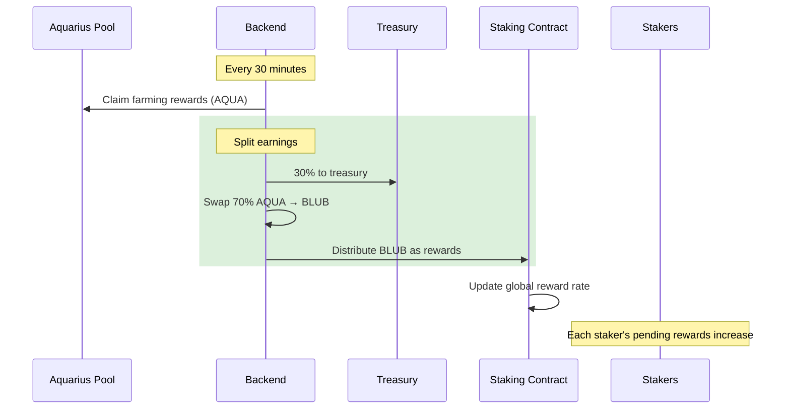

# Reward Distribution

Whalehub distributes rewards using the **Synthetix reward model** — a proven approach where rewards are split proportionally based on each user's share of the staking pool.

## How Rewards Flow



## The Math

When the protocol distributes `R` BLUB and `T` BLUB is currently staked:

```
Global rate increases by:  R / T

Your earned rewards:       Your staked BLUB × (Current rate - Your last checkpoint rate)
```

This means:
- If you hold **1%** of total staked BLUB, you earn **1%** of every distribution
- Your rewards accumulate automatically — no action needed until claiming
- The rate checkpoint updates whenever you lock, unstake, or claim

## Distribution Frequency

| Action | Frequency |
|--------|-----------|
| Pool reward claiming | Every 30 minutes |
| Treasury split (30%) | Every 30 minutes |
| Staker distribution (70%) | Every 30 minutes |
| User claiming | Every 7 days (minimum) |

## Fee Structure

| Fee | Amount | Destination |
|-----|--------|-------------|
| Treasury fee | 30% of pool earnings | Protocol treasury |
| Staker share | 70% of pool earnings | Distributed as BLUB |
| Staking fee | None | — |
| Claiming fee | None (only gas) | — |
| Unstaking fee | None (only gas) | — |
