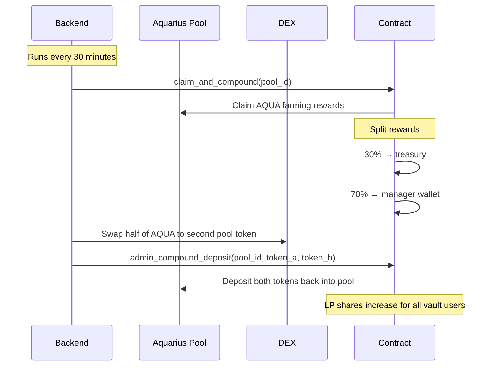

# Auto-Compounding

Whalehub's backend automatically compounds vault rewards 48 times per day, maximizing yield without any manual action.

## How It Works

## Reward Split

| Portion | Destination | Purpose |
|---------|------------|---------|
| 30% | Protocol treasury | Sustains development and operations |
| 70% | Re-deposited into pool | Grows all vault users' positions |

## Compound Effect

The power of 48x daily compounding:

| Base Pool APY | Compounded APY | Extra Yield |
|---------------|---------------|-------------|
| 10% | 10.5% | +0.5% |
| 25% | 28.4% | +3.4% |
| 50% | 64.8% | +14.8% |
| 100% | 171.5% | +71.5% |

## Tracking Your Gains

The vault interface shows:
- **Your LP tokens**: current position size
- **Deposit amount**: what you originally deposited
- **Compound gains**: how much your position has grown from auto-compounding
