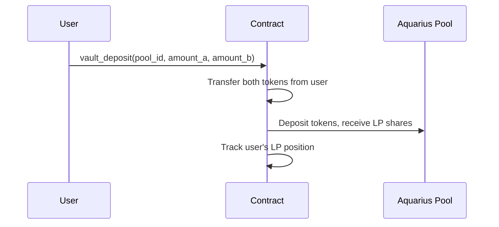

# Depositing Liquidity

To use a vault, you deposit both tokens of a pool pair. Your deposit is added to the Aquarius AMM pool and begins earning immediately.

## How to Deposit

1. Navigate to the **Liquidity Vaults** section
2. Select a pool from the dropdown (e.g. XLM / AQUA)
3. Enter the amount for one token — the other will auto-calculate based on the current pool ratio
4. Set your slippage tolerance (default: 0.5%)
5. Click **Deposit** and confirm in your wallet

## What Happens On-Chain

## Slippage Protection

Pool ratios can shift between when you preview and when your transaction executes. Slippage tolerance defines the maximum acceptable difference:

| Setting | Risk Level | When to Use |
|---------|-----------|-------------|
| 0.5% | Low | Normal conditions |
| 1.0% | Medium | Moderate volatility |
| 2.0-5.0% | Higher | High volatility or large deposits |

If the actual price moves beyond your tolerance, the transaction is rejected and your tokens are returned.

## Minimum Deposit

Each pool has a minimum deposit amount determined by the pool's current state. Very small deposits may be rejected if they would produce fewer LP shares than the minimum threshold.
