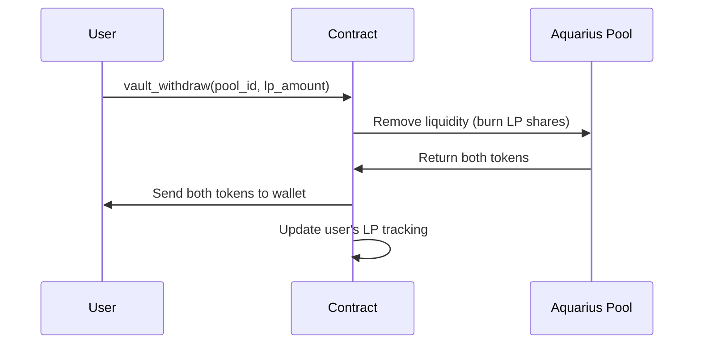

# Withdrawing from Vaults

Unlike staking, vault positions have **no lock period**. You can withdraw your liquidity at any time.

## How to Withdraw

1. Navigate to the **Liquidity Vaults** section
2. Switch to the **Withdraw** tab
3. Enter the amount of LP tokens to withdraw (or click Max)
4. Set your slippage tolerance
5. Click **Withdraw** and confirm in your wallet

## What Happens On-Chain

## What You Receive

When you withdraw, you receive **both tokens** of the pool pair in the current ratio. This may differ from your original deposit ratio due to:

- **Pool ratio changes** — the token proportions shift as trades occur
- **Compound growth** — auto-compounding increases your total position
- **Impermanent loss** — if token prices diverged significantly since deposit

## Fees

- **No withdrawal fee** — you receive 100% of your LP position value
- The 30% treasury fee is only applied to compounding rewards, not withdrawals
